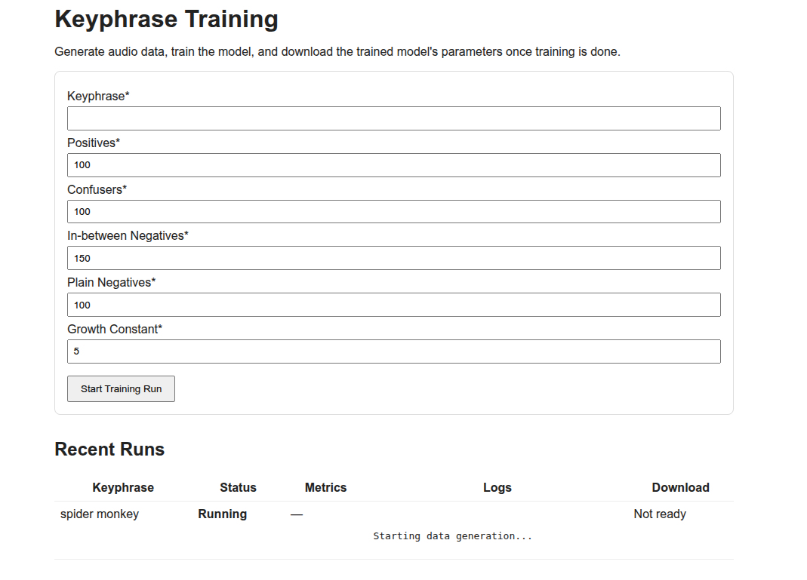

# Phrase recognition service Django MLaaS

### - User enters phrase. 
### - The backend trains a lightweight AI to detect the phrase in audio. 
### - Training is finished ->  user can download trained model
### - User can run inference locally thanks to small size.

# The model

The core model is a small convolutional–recurrent network (`TinyCRNN`) trained as a
**binary classifier: “does this window contain the keyphrase?”**.

- **Input**: log-mel spectrograms
- **Backbone**: a lightweight CNN + RNN over time (see `model/model.py`) to extract features, then MLP head turns them into scores.
- **Output**: a single logit per window, trained with `BCEWithLogitsLoss`.
- **Training loop**:
  - Data is generated and indexed into a pandas `DataFrame`.
  - `AudioDataset` (in `model/dataset.py`) loads audio paths, resamples, builds spectrograms, and yields `(spec, label)` pairs.
  - `pipeline/training_pipeline.py` wraps the whole process (data generation -> dataset -> training -> saving a `.pt` file).
- **Entry points**:
  - CLI: `python main.py` prompts for a keyphrase, generates data, trains, and prints metrics.
  - Web UI: `uv run webui/manage.py runserver` starts the Django app where you can enter a phrase and download the trained model.

# Dataset

Some audio data is synthesized on the fly and cached in an **SQLite database** for reuse. 
A large portion is reused to speed up user experience
## Reusing
I have put a significant amount of effort to reuse as much of the data as possible.  
- With SQL I find samples containing the keyphrase. Knowing the transcripts for everything, I use CTC segmentation (publicly available lightweight model) to find they keyphrase in audio and feed it to the dataset.
- Naturally I can find many more negatives, so most negatives are already present in the database (**except for confusers**)

## Data generation
- **Phrase buckets** (`generate_with_augmentations`):
  - **Positives**: phrases that contain the keyphrase.
  - **Confusers**: similar-sounding phrases that should *not* trigger.
  - **In-between negatives**: phrases partially overlapping semantically or phonetically.
  - **Plain negatives**: unrelated phrases from a background corpus.
- **Augmentation**:
  - Text: `phrase_augmentation/*` generates variations (extra words, word swaps, confusers, punctuation).
  - Audio: `audio_augmentation/*` applies timing crops, silence trimming, etc., to diversify the same phrase.
- **TTS backends** (`audio_generation/*`):
  - Multiple engines (Piper, Kokoro, Suno/Bark, ElevenLabs) can be used to synthesize each phrase.
  - Each engine runs in an isolated environment and returns metadata (path, duration, sample rate, text, API name).
- **Big natural speech datasets** 
  - I'm also taking samples from the TPS corpus to save some time on generating plain negatives with TTS.
- **Database & reuse**:
  - All generated samples are indexed in `db/db.sqlite3` via `db/db_api.py` so future runs can reuse them.
  - For each category, the generator:
    - Counts how many suitable clips already exist in the DB.
    - Computes a **target number of clips** = `num_phrases * clips_per_phrase`.
    - Generates `max(growth_constant, target - existing)` brand-new clips so the dataset keeps growing over time.

### Setup

- **Create Python env & install deps**
  - `python3 -m venv .venv && source .venv/bin/activate`
  - `pip install -r requirements.txt`

- **Initialize the audio samples database**
  - `sudo apt install sqlite3`
  - `sqlite3 db/db.sqlite3 < db/db.sql`

- **(Optional) ElevenLabs TTS API key**
  - This is only needed if you want premium TTS as part of data generation.
  - Create `.env` with your API key:
    - `cd audio_generation/elevenlabs_side/internals`
    - `nano .env`
    - Add: `ELEVENLABS_API_KEY=<your key>`

- **Prepare Django web UI database**
  - `cd webui`
  - `python manage.py migrate`

- **Run the web UI**
  - From repo root (venv active): `python webui/manage.py runserver`
  - Open `http://127.0.0.1:8000` in your browser, enter a keyphrase, start a run, then download the model once training completes.

- **Run the CLI pipeline instead (no UI)**
  - From repo root: `python main.py`
  - Enter a keyphrase when prompted; the script will generate data, train, and print final metrics + model path.

